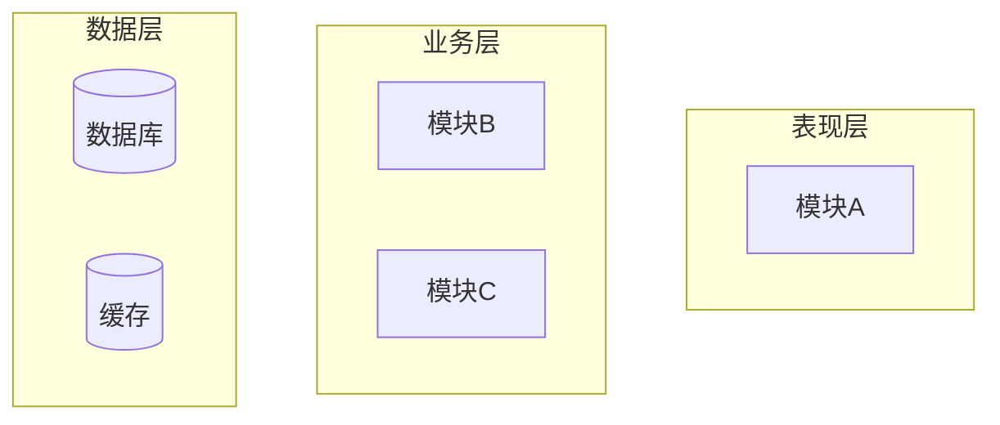
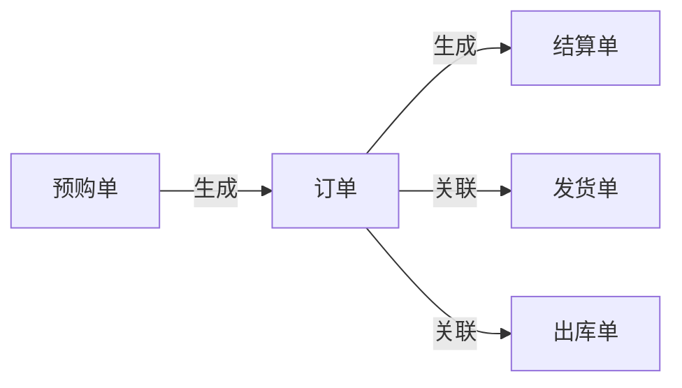
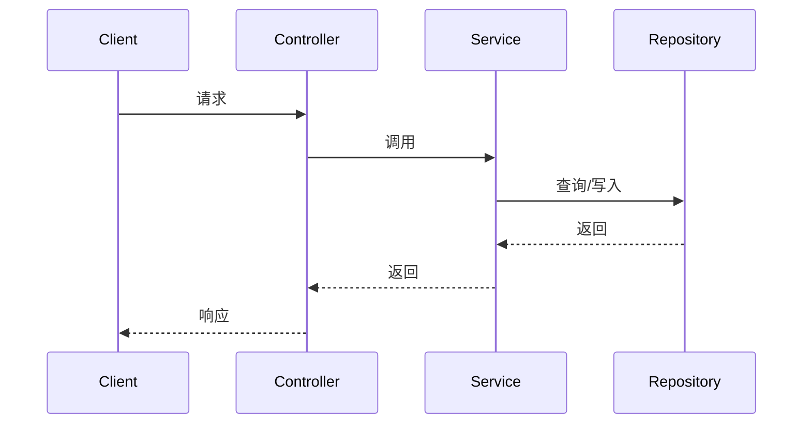
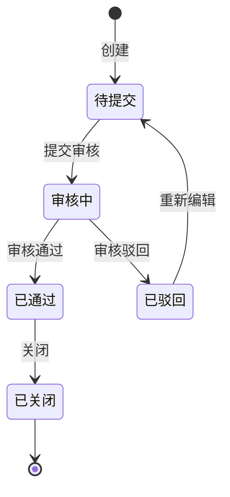

# [项目名称] 详细设计文档

---

## 1. 概述

### 1.1 文档目的

<!-- 说明本文档的目标读者和用途 -->
[待填写：例如"本文档为 XXX 系统的详细设计文档，面向开发、测试和运维人员，指导系统的编码实现与测试验证。"]

### 1.2 适用范围

<!-- 说明本文档覆盖的系统/模块范围 -->
[待填写]

### 1.3 术语与缩略语

| 术语/缩略语 | 全称 | 说明 |
|-------------|------|------|
| [缩写] | [全称] | [说明] |

---

## 2. 系统架构设计

### 2.1 系统上下文

<!-- 描述系统与外部实体（用户、外部系统、硬件等）的关系 -->
<!-- 建议附系统上下文图 -->

**外部交互方：**

| 外部实体 | 交互方式 | 说明 |
|----------|----------|------|
| [用户/系统名称] | [HTTP/MQ/RPC等] | [交互说明] |

### 2.2 整体架构

<!-- 描述系统的分层/模块划分，建议附架构图 -->
<!-- 架构图可使用 Mermaid 语法嵌入 -->



[待填写：架构说明]

### 2.3 技术选型

| 技术领域 | 选型 | 版本 | 选型理由 |
|----------|------|------|----------|
| 后端框架 | [待填写] | [版本] | [理由] |
| 前端框架 | [待填写] | [版本] | [理由] |
| 数据库 | [待填写] | [版本] | [理由] |
| 缓存 | [待填写] | [版本] | [理由] |
| 消息队列 | [待填写] | [版本] | [理由] |
| 部署环境 | [待填写] | - | [理由] |

### 2.4 部署架构 [可选]

<!-- 描述生产环境的部署拓扑，建议附部署图 -->
<!-- 包括服务器数量、负载均衡、容灾策略等 -->

[待填写]

### 2.5 业务实体关系图 [重要]

<!-- 用 Mermaid 图描述模块内核心业务实体之间的关系与生成链路 -->



---

## 3. 模块详细设计

<!-- 对每个核心模块重复以下结构 -->

### 3.x [模块名称]

#### 3.x.1 模块职责 [重要]

<!-- 一句话概括模块的核心职责 -->

| 项目 | 说明 |
|------|------|
| 模块名称 | [待填写] |
| 所属层次 | [表现层/业务层/数据层/基础设施层] |
| 核心职责 | [待填写] |
| 依赖模块 | [列出依赖的其他模块] |


#### 3.x.2 核心流程 [重要]

<!-- 对每个核心流程重复以下结构 -->

<!-- 用时序图或活动图描述核心业务流程 -->

**[流程名称]**



**业务规则**

| 规则编号 | 规则描述 | 条件 | 动作 | 
|----------|----------|------|------|--------|
| BR-001 | [规则名] | [触发条件] | [执行动作] |


**边界条件与异常处理**

| 场景 | 处理方式 |
|------|----------|
| [边界场景1] | [处理方式] |
| [异常场景1] | [处理方式] |

**流程详细描述**
<!-- 详细描述流程的业务逻辑，比如在XX情况下要执行XX逻辑，在YY情况下要执行YY逻辑 -->
[待填写]


#### 3.x.3 状态设计 [重要]

<!-- 仅适用于有状态管理的模块 -->
<!-- 用 Mermaid 状态图描述状态机，更直观地展示状态流转 -->



**状态说明：**

| 状态 | 含义 | 触发条件 |
|------|------|----------|
| 待提交 | [说明] | [创建时进入此状态] |
| 审核中 | [说明] | [提交审核后进入] |
| 已通过 | [说明] | [审核通过后进入] |
| 已驳回 | [说明] | [审核驳回后进入] |
| 已关闭 | [说明] | [手动关闭或流程结束] |

---

## 4. 数据设计

### 4.1 数据库设计

#### 4.1.1 ER 关系图

<!-- 建议附 ER 图，说明核心实体及其关系 -->

[待填写]

#### 4.1.2 表结构定义

<!-- 对每张表重复以下结构 -->

**表：[table_name]**

| 字段名 | 类型 | 是否可空 | 默认值 | 说明 |
|--------|------|----------|--------|------|
| id | BIGINT | NOT NULL | AUTO_INCREMENT | 主键 |
| [字段名] | [类型] | [NULL/NOT NULL] | [默认值] | [说明] |
| created_at | DATETIME | NOT NULL | CURRENT_TIMESTAMP | 创建时间 |
| updated_at | DATETIME | NOT NULL | CURRENT_TIMESTAMP ON UPDATE | 更新时间 |

**约束：**
- 主键：`id`
- 唯一索引：`[待填写]`
- 外键：`[待填写]`

### 4.2 数据字典 [可选]

<!-- 补充说明枚举值、状态码等业务含义 -->

| 字段 | 值 | 含义 |
|------|-----|------|
| [status] | 0 | 禁用 |
| [status] | 1 | 启用 |

---

## 5. 接口设计

### 5.1 外部 API

<!-- 对每个接口重复以下结构 -->

#### `POST /api/v1/[resource]`

| 项目 | 说明 |
|------|------|
| 接口名称 | [待填写] |
| 接口描述 | [待填写] |
| 认证方式 | [Bearer Token / API Key / 无] |

**请求参数：**

| 参数名 | 位置 | 类型 | 必填 | 限定规则 | 说明 |
|--------|------|------|------|------|
| [param] | Body/Query/Path | [type] | 是/否 | 长度、范围、正则等 | [说明] |

**请求示例：**
```json
{
  "field1": "value1"
}
```

**响应参数：**

| 参数名 | 类型 | 说明 |
|--------|------|------|
| code | Integer | 状态码 |
| message | String | 提示信息 |
| data | Object | 业务数据 |

**响应示例：**
```json
{
  "code": 0,
  "message": "success",
  "data": {}
}
```

**错误码：**

| 错误码 | HTTP状态码 | 说明 |
|--------|-----------|------|
| [ERROR_CODE] | [400/401/403/404/500] | [说明] |

### 5.2 内部模块接口

<!-- 模块间调用关系与接口约定 -->

| 调用方 | 被调用方 | 接口/方法 | 调用方式 | 说明 |
|--------|----------|-----------|----------|------|
| [模块A] | [模块B] | [method] | [同步/异步/MQ] | [说明] |

### 5.3 第三方服务集成 [可选]

| 服务名称 | 提供方 | 接口协议 | 调用方式 | 超时设置 | 降级策略 |
|----------|--------|----------|----------|----------|----------|
| [服务名] | [厂商] | [HTTP/gRPC] | [SDK/直连] | [超时ms] | [降级方案] |

---

## 附录 [可选]

### A. 配置项说明

| 配置项 | 环境 | 默认值 | 说明 |
|--------|------|--------|------|
| [config_key] | [DEV/PROD] | [value] | [说明] |

### B. 错误码表

| 错误码 | HTTP状态码 | 错误信息 | 处理建议 |
|--------|-----------|----------|----------|
| [CODE_001] | [400] | [message] | [建议] |

### C. 枚举值定义

| 枚举类 | 值 | 含义 |
|--------|-----|------|
| [EnumName] | [VALUE] | [含义] |
